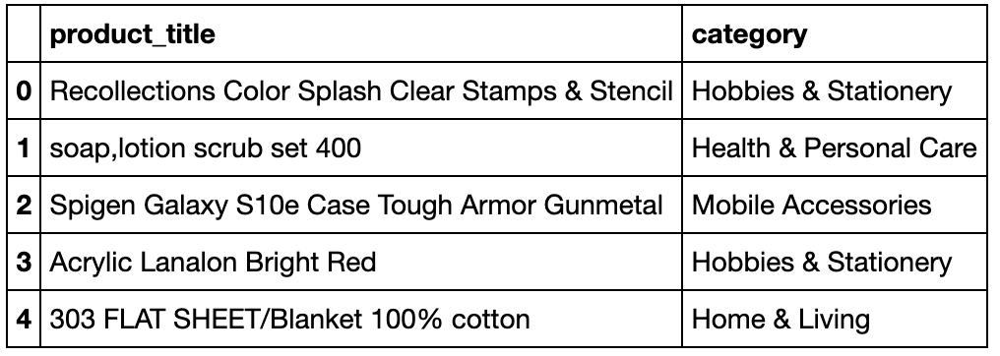
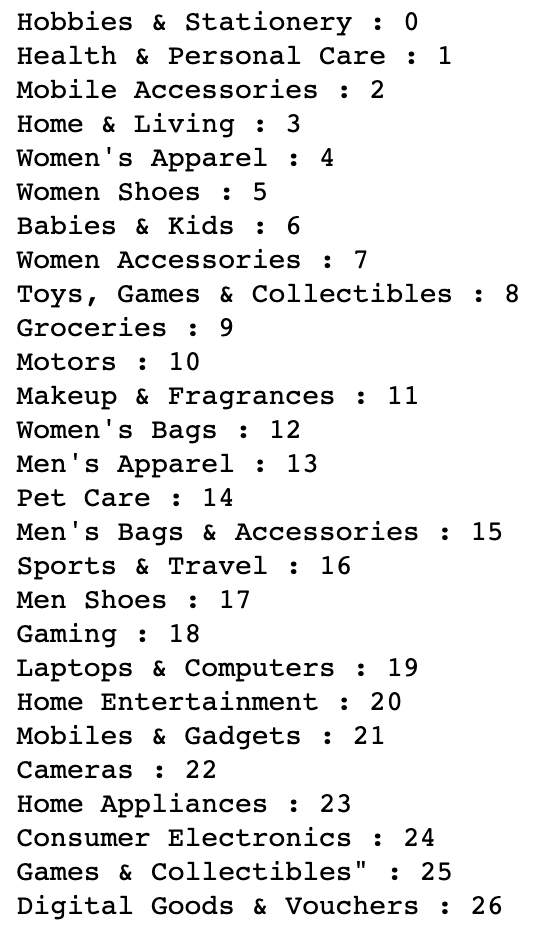
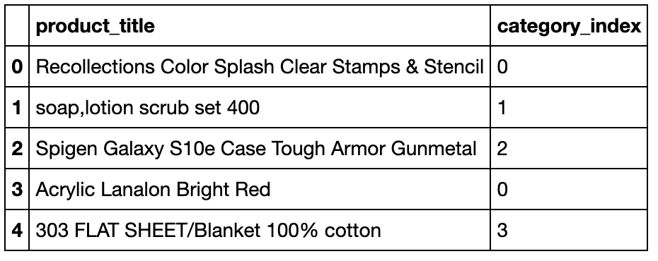
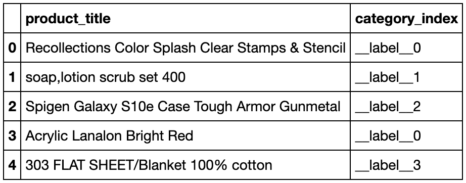
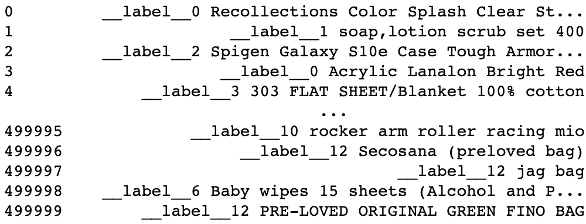

# ML-Text-Classification-with-fastText
Classifying products into product categories with the fastText machine learning library. [fastText](https://fasttext.cc/docs/en/support.html) is a library for efficient learning of word representations and sentence classification.

## Introduction
I have file of 500000 rows of raw data of product names with their product category and I'm using fastText to train a model to classify products into their corresponding product category.

This is the structure of the data when loaded into a dataframe:

## Process

### Cleaning
There was a lot of cleaning that needed to be done to the dataset because not only did I need to clean it to fit it into a fastText model, some rows of data were inconsistent and included emojis. I created a function to remove all non-ascii characters from the data, then imputed the few entries where multiple products and categories jumbled together instead of being in their separate columns.

### Feature Engineering
I then created a new column for categories as integers by mapping each category to a number because it's easier to work with. 

These are the mappings from category to integer:

These are the first 5 lines of the new dataframe with the numbered categories:

### Formatting for fastText
The format of the text that goes into a fastText is a series/list of strings, with each element including an item name and its respective labels in one string. All the labels/categories in fastText start by the "\_\_label\_\_" prefix, which is how fastText recognize what is a label or what is a word. The model is then trained to predict the labels given the word in the document. So now I will add \_\_label\_\_ in front of the category for fastText to read it as a label and then combine the labels and words into a single string. I believe fastText has its labels formatted this way because this then this model would work even if the products belonged to multiple categories/labels.

Added "\_\_label\_\_" in front of the category_index:

Combined each product name with their label and put them into a series:

### Model
Finally, I split the data: 70% train and 30% test. I created the model and tried improving the performance of it by adjusting the wordNgrams parameter, which by default is 1 (a unigram). I tried using word bigrams (wordNgrams = 2), instead of just unigrams. Instead of inputting single words into the model, putting 2 consecutive tokens or words in can be important for classification problems where word order is important, such as sentiment analysis.

## Results
After tuning the model, the precision reached 81.01%. I think a precision of 81.01% is pretty good for my first time working with a classification model, though it can definitely be improved. For next time, I will look more into the different parameters and work on hyperparameter tuning for my models. Overall, I think fastText is a fairly nice and easy library to perform text classification on; however, the data used needs to be cleaned and formatted for fastText, which may take a while.
